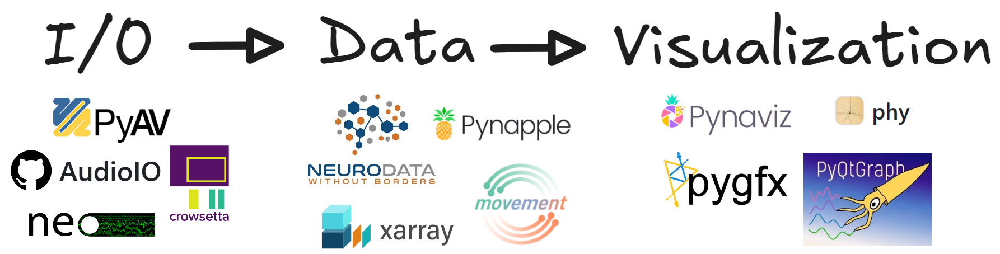

# ethograph


EthoGraph is a graphical user interface for visualizing and segmenting
multimodal timeseries behavioural data. It builds upon a number of
[open-source libraries](#support) to load and quickly render video and pose
files, audio and spectrograms, ephys recordings in various formats, and
arbitrary multi-dimensional timeseries — all on one shared timeline.

Note this GUI is still in development. I welcome people testing it and
[providing feedback](https://akseli-ilmanen.github.io/ethograph/community/contributing.html)!

📖 **[Documentation](https://akseli-ilmanen.github.io/ethograph/)**

🎥 **[Watch the demo](https://vimeo.com/1206424641)**

## Quickstart

To install the GUI, run the following. For more detailed instructions, see the
[installation guide](https://akseli-ilmanen.github.io/ethograph/getting_started/installation.html).

```bash
uv pip install "ethograph[gui,audio]" --python 3.12
```

To open the GUI, run:

```bash
ethograph launch
```

After launching, there are some
[example datasets](https://akseli-ilmanen.github.io/ethograph/examples/index.html)
you can explore the GUI with. To learn more about all the functionalities, I
recommend the
[user manual](https://akseli-ilmanen.github.io/ethograph/getting_started/user_manual.html).

## Support



EthoGraph is built on top of a number of open-source projects:
[PyAV](https://pyav.org/docs/stable/),
[audioio](https://github.com/bendalab/audioio),
[Neo](https://neo.readthedocs.io),
[crowsetta](https://github.com/vocalpy/crowsetta),
[Neurodata Without Borders](https://www.nwb.org/),
[xarray](https://docs.xarray.dev/),
[pynapple](https://pynapple.org/index.html),
[movement](https://movement.neuroinformatics.dev/),
[phy](https://github.com/cortex-lab/phy),
[PyQtGraph](https://www.pyqtgraph.org/), and
[pygfx](https://pygfx.org/) (via
[pynaviz](https://github.com/pynapple-org/pynaviz)).
