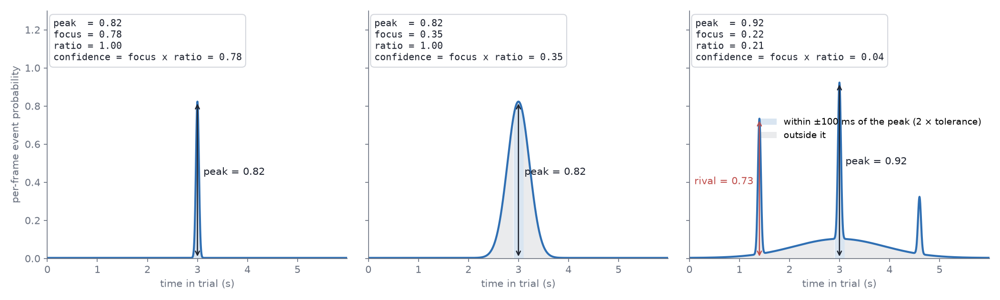

(target-confidence)=
# Confidence: what the number beside a predicted label means

Every predicted label carries a `confidence` in the labels TSV (a hand-placed
label is `1.0`), and the review tools threshold on it: the label grid outlines
tiles below **Flag confidence below**, **Histogram…** shows where the scores
sit per class, and *Mark low-confidence as uncurated* pre-selects exactly those
tiles. The number is computed by the model that made the prediction, and
**how** it is computed depends on what kind of question that model answered.
There are two kinds.

## State events: which class is this frame?

The segmentation pipeline (`eto.segment`) predicts **state events** — spans.
Its output is one probability distribution **over the classes at every
frame**: $p_1(t), \dots, p_C(t)$ with $\sum_c p_c(t) = 1$. The label at a
frame is the largest, and how sure the model is at that frame is how far the
distribution is from uniform — its normalised entropy
(`ethograph/labels/predictions.py`):

$$
H(t) = -\sum_{c=1}^{C} p_c(t)\,\log p_c(t), \qquad
\text{confidence}(t) = 1 - \frac{H(t)}{\log C}.
$$

`1` means all the mass sits on one class, `0` means every class is equally
likely. A segment's `confidence` in the TSV is the mean of this over its
frames, and the per-frame curve is what the review overlay draws. Entropy is
the natural measure here because the model's uncertainty *is* the spread
over classes: the question at each frame is "which one", and the answer is
a distribution over the alternatives.

## Point events: when did it happen?

The LightGBM onset model and the E2E-Spot pixel model predict **point
events**. For each class they produce a **curve over time**, $p_k(t)$, the
per-frame belief that class $k$'s event is *here*, and the prediction is the
tallest peak of that curve, $t^\ast = \arg\max_t p_k(t)$ (a local maximum —
a curve still climbing at the trial's edge is not a peak).

Entropy across classes says nothing useful about this: the question is not
"which class" but "**where** on the curve", and the alternatives are other
*moments*, not other classes. So the confidence is a statistic of the
curve's **shape around its peak**, read within a window $w$ of the peak
(`ethograph/labels/curve_confidence.py`):

$$
\text{peak} = p(t^\ast), \qquad
\text{focus} = \frac{\sum_{|t - t^\ast| \le w} p(t)}{\sum_t p(t)}, \qquad
\text{ratio} = 1 - \frac{\max_{t' \in \text{peaks},\; |t' - t^\ast| > w} p(t')}{p(t^\ast)},
$$

$$
\text{confidence} = \text{focus} \times \text{ratio}.
$$

- **peak** — the model's own score at the event.
- **focus** — the share of the curve's mass within $w$ of the peak: `1` is one
  clean bump, lower means a broad bump or belief spread elsewhere.
- **ratio** — one minus the tallest *rival* over the peak, a rival being
  another local maximum outside $w$ (never the peak's own shoulder): `1` is
  no rival, `0` a second candidate as tall as the first. Blind to width by
  design — width is `focus`'s job.
- **confidence** — both at once: a lone sharp bump reads near `1`, a rival
  or a smeared bump pulls it down.

**The window is the user's timescale, not a constant.** $w = 2 \times$ the
tolerance the labels are believed to: the onset model takes it from its own
`tolerance_s`, the pixel model from `infer.focus_window_ms` (twice the label
precision). A bump wider than twice the label precision is smeared by the
user's own definition; a peak further away than that is a rival.

**Which statistic is written is a property of the model, and it is
measured, not assumed.** On the same held-out trials, how well each
candidate separates the model's hits from its misses (AUC) decides:

- The **onset model** ranks every candidate per class when it trains
  (`fit_confidence_calibration`) and writes `peak` unless `focus`, `ratio` or
  their product wins by a clear margin — its curve is shape-constrained by construction (a
  Gaussian-weighted target smoothed with the matching kernel), so its bumps
  all look alike and height is what varies. The training message says which
  was chosen.
- The **pixel model** writes `focus × ratio`. E2E-Spot's per-frame softmax
  normalises across classes and nothing normalises across time, so a class
  can sit moderately high for a long stretch and its peak still reads as
  confident: height was near chance (AUC 0.58) where `focus`, `ratio` and
  their product reached ~0.8. The two halves behave differently in a histogram — `ratio`
  is bimodal (one candidate or two), `focus` sits in a middle band — so how
  much each should count is a review preference, not a model constant: the
  written number is the plain product, and the emphasis is set in the GUI
  with the histogram in view.

Every candidate stays readable off the curve frame-by-frame review draws
under the label (one per class in scope, on a fixed 0–1 axis): the peak the
label sits on, the rival that pulled `ratio` down, the smear that pulled
`focus` down. That is what lets a threshold be set by looking.

**How often a model is right is a verdict on the model, not on a label.**
Training reports the held-out hit rate per class (*peck: 6/8 within
0.05 s*); it is never folded into any label's confidence.

## Reviewing by confidence

**Label grid view…** (Labels tab ▸ Curation) puts each label's confidence
and `labeling_method` on its tile and outlines everything below **Flag
confidence below** in red, in the grid and in the exported PDF. The threshold
is typed in full rather than stepped, so a model whose scores sit at the
bottom of the range can be flagged at `0.0002` as easily as at `0.6`;
**Histogram…** beside it shows where the scores actually sit, per class,
before you commit — with a bimodal statistic such as `ratio` the gap is
where the threshold goes.

In the default *Click = uncurated, rest = curated* mode, **Mark low-confidence
as uncurated** pre-clicks exactly the outlined tiles; click any other tile
that looks wrong, and **Done** curates everything else in one go. With the
Curation section in frame-by-frame review, a tile click drops straight into
that boundary instead: `Enter` moves the event onto the right frame,
`Backspace` deletes one that never happened, `N` marks it curated.

Judge a cutoff by what it buys: on a session with curated labels, "reviewing
everything below *t* catches what share of the errors?" is the question the
confidence exists to answer, and it is a better guide than how the histogram
looks.
