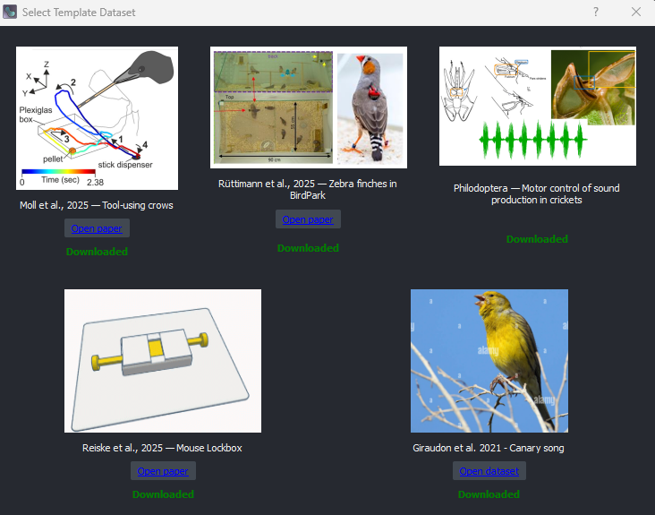

(target-data-loading)=
# Loading Data

EthoGraph works with NetCDF (`.nc`) session files. You can either load a pre-made `session.nc`[^1] or create one from your own data using the built-in creation dialog. `session.nc` files store behavioural data, labels, and metadata from a multi-trial session in **one file**.

---

## Try the GUI with template datasets

The quickest way to explore the GUI: click **Select templates** in the I/O widget, pick a dataset, and click **Load**.



---

## Option 1: Load a pre-made session.nc

If you already have a `session.nc` file (e.g. from an ethograph pipeline or {doc}`loading_script`):

1. In the **I/O** widget, select your session data **file** (`.nc`)
2. Select the video **folder** containing camera recordings (`.mp4`) [^4]
3. [Optional] Select the audio **folder** containing microphone recordings (`.wav`, `.mp3`, `.mp4`) [^2]
4. [Optional] Select the tracking **folder** containing pose estimation files (`.h5`, `.csv`) [^3]
5. [Optional] Select the ephys **file** (`.rhd`, `.abf`, ...) or the **Kilosort folder**
6. Click **Load**

---

## Option 2: Create a session.nc from your own data

Click **Create with own data** in the I/O widget. A dialog guides you through creating a `session.nc` from several supported sources. After generation the I/O fields are auto-populated so you can click **Load** immediately.

The dialog handles **single-file** workflows. For multiple trials, multiple cameras, or multiple microphone files a short Python script is required.

| Format | When to use | Guide |
|--------|-------------|-------|
| Pose file | DLC, SLEAP, LightningPose `.h5`/`.csv` | {doc}`loading_pose` |
| Xarray dataset | Movement-style `.nc` | {doc}`loading_pose` |
| Audio file | Vocal / acoustic data | {doc}`loading_audio` |
| Numpy file | Pre-computed feature array | {doc}`loading_numpy` |
| Ephys recording | Raw electrophysiology +/- Kilosort | {doc}`loading_ephys` |
| Custom script | Multi-trial, multi-cam, multi-mic | {doc}`loading_script` |

---

## Folder structure

```
processed_data/
    └── ses-20220509/
        ├── session.nc                 # Main behavioural dataset (required)
        └── labels/                   # Label files (created by GUI)
            ├── session_labels_20240315_143022.nc
            └── session_labels_20240316_091045.nc
rawdata/
└── ses-20220509/
    ├── video/
    │   ├── camera1_trial001.mp4
    │   ├── camera1_trial002.mp4
    │   ├── camera2_trial001.mp4
    │   └── camera2_trial002.mp4
    ├── tracking/
    │   ├── trial001_pose.h5
    │   └── ...
    ├── audio/
    │   ├── mic1_trial001.wav
    │   └── ...
    └── ephys/
        ├── recording.rhd
        └── kilosort4/
            ├── params.py
            ├── spike_times.npy
            ├── spike_clusters.npy
            ├── channel_positions.npy
            ├── channel_map.npy
            ├── templates.npy
            └── cluster_info.tsv
```

[^1]: `session.nc` is just an example file name; you may name it differently.

[^2]: If your video files (e.g. `.mp4`) contain audio, the video and audio folder will be the same.

[^3]: Pose files are loaded via the {mod}`movement` library.

[^4]: You can also load `.avi` and `.mov` files, but they have inaccurate frame seeking (off by 1-2 frames). For best results, transcode to `.mp4` with H.264. See {doc}`../user_guide/troubleshooting`.

```{toctree}
:maxdepth: 1

loading_pose
loading_audio
loading_numpy
loading_ephys
loading_script
```
