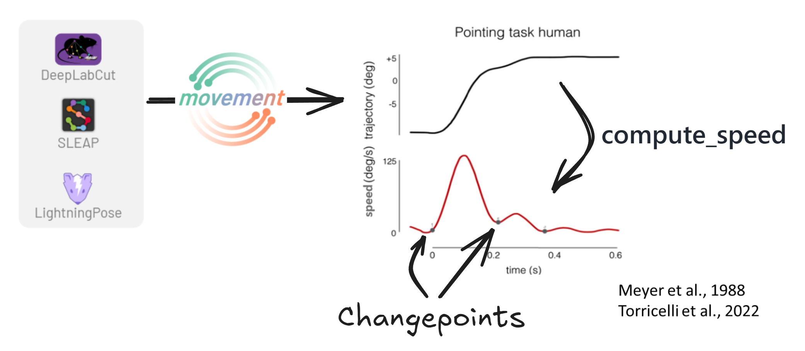
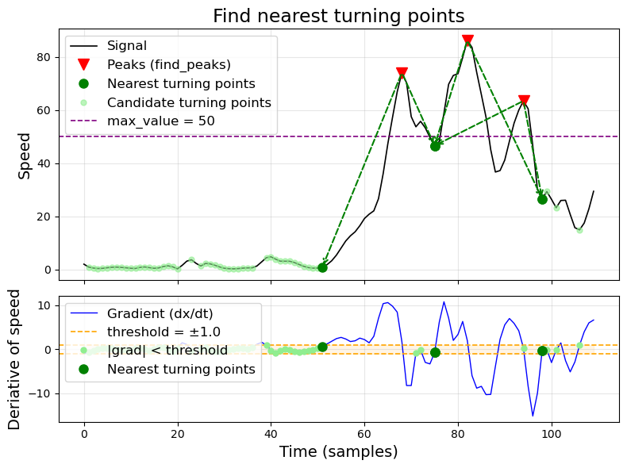

(target-kinematic-changepoints)=
# Kinematic changepoints

One example of changepoints occurring at behavioural boundaries are speed
minima. In point-to-point reaching tasks, the hand speed profile is
characterised by a unimodal bell-shaped curve with two speed minima
(Torricelli et al., 2023), where the minima correspond to the onset and
offset of the movement, and the peak of the speed bump marks the point where
the hand starts decelerating. These minima can even be used to identify
sub-movements, such as the small second corrective speed bump in the figure
below (Meyer et al., 1988).



---

## Troughs (local minima)

Finds local minima in the signal using `scipy.signal.find_peaks` applied to
the negated signal. Troughs in speed often correspond to moments where an
animal pauses or reverses direction.

Parameters are passed directly to {func}`scipy.signal.find_peaks`: `height`,
`distance`, `prominence`, `width`, etc.

---

## Turning points

A custom algorithm that identifies the boundaries of peak regions rather than
the peaks themselves. The idea is that behaviour transitions happen not at
the peak of a movement, but where the animal starts or stops accelerating.



The algorithm works in four steps:

1. **Compute the gradient** of the signal and find all indices where `|gradient| < threshold` — these are candidate turning points (near-stationary regions).
2. **Find peaks** in the original signal using `scipy.signal.find_peaks` with `prominence` and `width` parameters.
3. **For each peak**, select the closest candidate turning point to its left and right. These define the boundaries of the peak region.
4. **Filter by `max_value`**: any candidate turning point where the signal exceeds `max_value` is discarded. This prevents selecting turning points on high speed plateaus.

**Parameters:**

| Parameter | Description |
|-----------|-------------|
| `threshold` | Maximum absolute gradient to qualify as a turning point. Lower = only very flat regions. |
| `max_value` | Discard turning points where signal exceeds this value. |
| `prominence` | Minimum peak prominence (passed to `find_peaks`). |
| `distance` | Minimum distance between peaks (passed to `find_peaks`). |

All kinematic changepoints also include NaN-boundary markers — transitions
between valid data and NaN gaps are automatically added as changepoints.

---

## Usage

1. Select a feature in the Data Controls (e.g. `speed`).
2. Open the **Kinematic CPs** panel.
3. Choose a method (`troughs` or `turning_points`).
4. Click **Configure...** to adjust parameters.
5. Click **Detect**.

The changepoints are stored in the dataset as `{feature}_{method}` (e.g.
`speed_troughs`) and persist when you save.

---

## Data format

::::{tab-set}

:::{tab-item} Xarray

Changepoint arrays are binary (`0` or `1`) integer arrays that share the
same time dimension as their target feature. They require:

- `attrs["type"] = "changepoints"`
- `attrs["target_feature"]` — name of the feature variable they annotate

```python
ds["speed_troughs"] = xr.DataArray(
    cp_binary,                           # shape: (time, keypoints, individuals), values 0 or 1
    dims=["time", "keypoints", "individuals"],
    attrs={
        "type": "changepoints",
        "target_feature": "speed",
    },
)
```

To compute changepoints programmatically, use
{func}`~ethograph.io.dataset.add_changepoints_to_ds`:

```python
import ethograph as eto
from ethograph.features.changepoints import find_troughs_binary

ds = eto.add_changepoints_to_ds(
    ds,
    target_feature="speed",
    changepoint_name="troughs",
    changepoint_func=find_troughs_binary,
)
```

{func}`~ethograph.io.dataset.add_changepoints_to_ds` uses
{func}`xarray.apply_ufunc` with `vectorize=True`, so your detection function
only needs to handle a 1-D signal.
:::

:::{tab-item} Pynapple

For pynapple data, changepoints are stored as a
{class}`~pynapple.TsGroup` — one timestamp series per unit (keypoint,
channel, neuron, ...) with metadata columns marking it as a changepoint set.

Use {func}`~ethograph.io.pynapple.add_changepoints_to_nap`:

```python
import pynapple as nap
from ethograph.io.pynapple import add_changepoints_to_nap
from ethograph.features.changepoints import find_troughs

speed = nap.TsdFrame(
    t=time_s,
    d=speed_array,                       # shape: (n_time, n_keypoints)
    columns=["nose", "left_ear", "right_ear", "tail"],
)

cps = add_changepoints_to_nap(
    speed,
    target_feature="speed",
    changepoint_func=find_troughs,
    prominence=0.1,
)
# cps is a TsGroup — one Ts per column with:
#   metadata.source_label = column name (e.g. "nose")
#   metadata.target_feature = "speed"
#   metadata.type = "changepoints"
```

Accepts {class}`~pynapple.Tsd`, {class}`~pynapple.TsdFrame`, or
{class}`~pynapple.TsGroup` as input. Existing metadata columns are carried
through when the input is a `TsGroup`.
:::

::::

---

## References

- Meyer, D. E., Abrams, R. A., Kornblum, S., Wright, C. E., & Keith Smith, J. E. (1988). Optimality in human motor performance: Ideal control of rapid aimed movements. Psychological Review, 95(3), 340-370. <https://doi.org/10.1037/0033-295X.95.3.340>
- Torricelli, F., Tomassini, A., Pezzulo, G., Pozzo, T., Fadiga, L., & D'Ausilio, A. (2023). Motor invariants in action execution and perception. Physics of Life Reviews, 44, 13-47. <https://doi.org/10.1016/j.plrev.2022.11.003>
