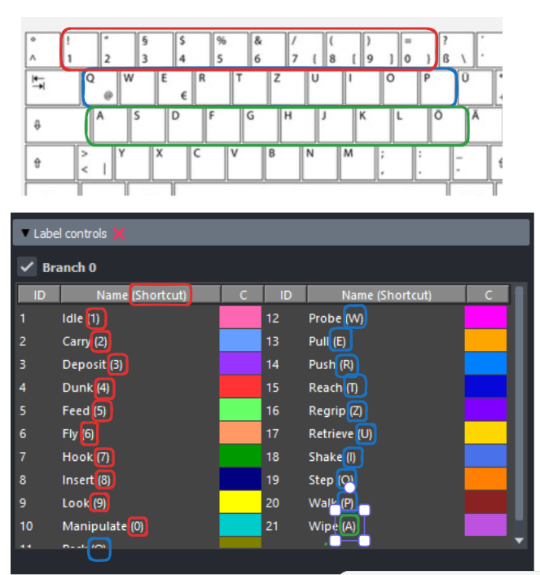

(target-labelling-gui)=
# Labelling in the GUI

Before closing, you will be prompted to `update with labels and save` — this
takes the `labels.nc` file and updates the `session` file with this info.
Don't skip this step; it may take a minute.

---

## Creating labels

To create a new behavioural label:

1. Press one of the number/letters keys to activate a specific behavioural label.
2. Click twice on the line plot to define the start and end boundaries of the label.
3. The label will be created and displayed with a color-coded overlay.

---

## Playing back labels

Once you've created a label, click on it and press `v` to play the segment.

You can also use `Left` / `Right` to navigate individual frames, or right-click
to jump to specific timepoints. Over time you may find this faster than
playing the video.

---

## Editing and deleting labels

Use the labels widget interface:

- **Edit**: Select a label (Left-click), press `Ctrl + E`, then click twice to define new start/stop boundary.
- **Delete**: Select a label (Left-click), press `Ctrl + D` to delete.

---

## Changepoint correction

See {doc}`../changepoints/correction` for how label boundaries are snapped to
detected changepoints.
